# Github使用方法

诸位同学在本课程中学会git clone就可以了

[TOC]

**对于新手，建议使用第二种方法；对于想要体验原生Git的，可以选择第一种方法（其实也不难）；对于实在搞不清楚的，可以用第三种方法（比较繁琐）**

## 方法1

- 安装git 

[Git 安装和使用教程 - yanlei的文章 - 知乎 ](https://zhuanlan.zhihu.com/p/34434428)

参考这一片文章**Git客户端下载、Git客户端安装**，部分安装好Git

安装好后，在文件夹中右键，会多出两个选项：

代表安装成功。

- clone项目（复制整个工程）
  
  1. 在Github上找到你想要克隆的项目的地址，并复制。
  
     
  
     要注意别复制成了网页的地址：
  
     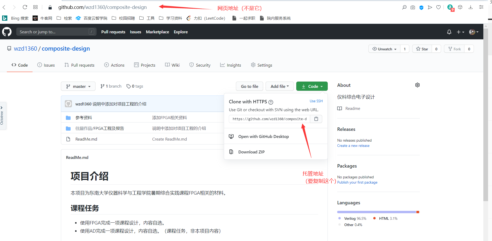
  
     
  
  2. 在本地找到你想要安放项目的地方
  
     
  
     比如这种干干净净的
  
  3. 在文件夹里右键，选择**Git Bash Here** 
  
     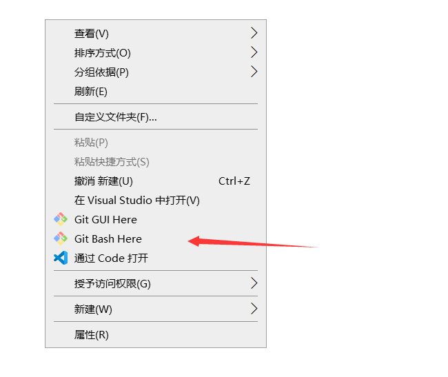
  
     然后会弹出这样一个对话框
  
     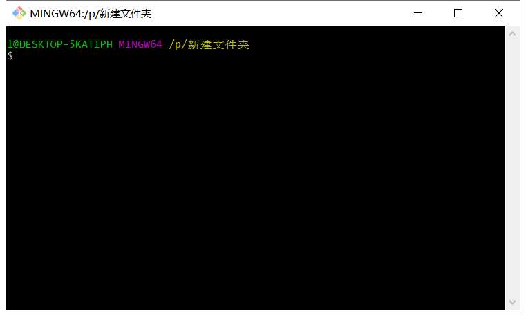
  
  4. git clone大法
  
     在对话框中打入
  
     > git clone
  
     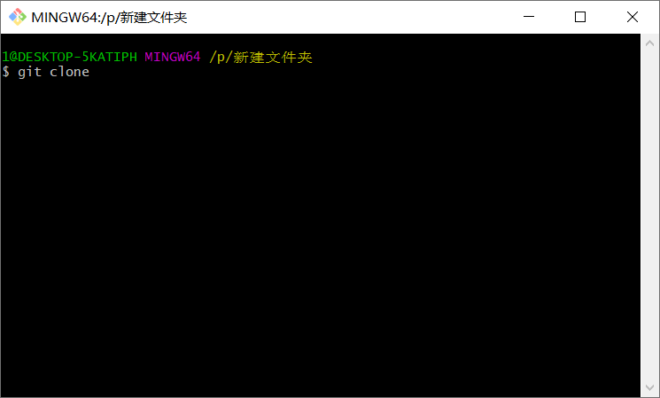

然后右键点**"Paste"**，把第一步里复制的地址粘贴到对话框

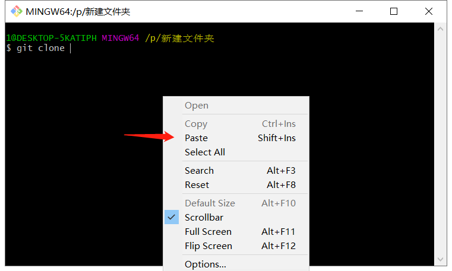

*要是贴不出来，回去重新复制一下*

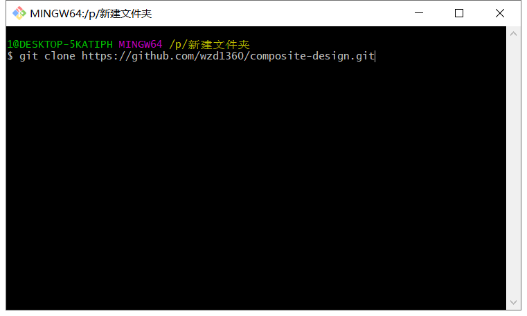

按回车，终端会自动从github仓库（存储项目的地方）下载文件。

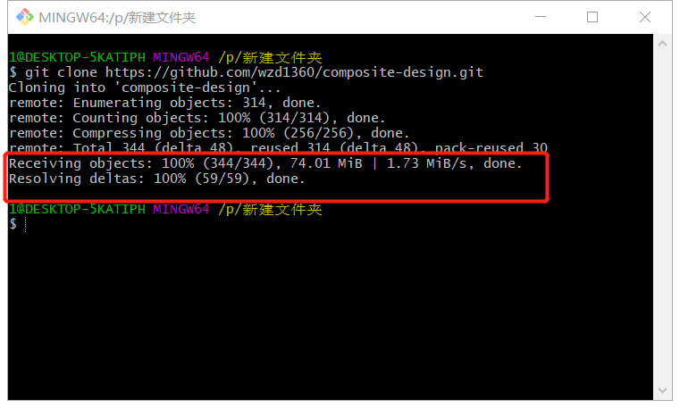

看到这两条提示，克隆完成。

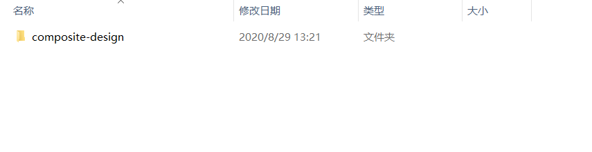

文件里夹的内容和网页内容一样。

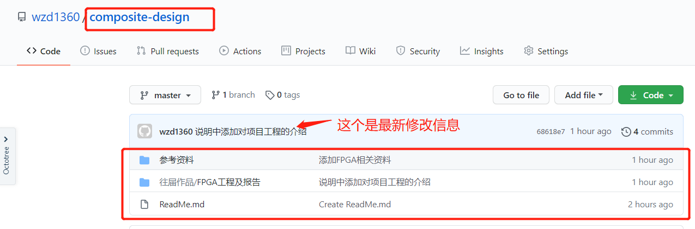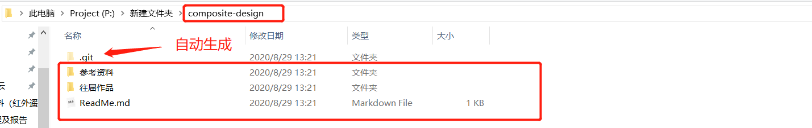

## 方法2

- 安装Github Desktop

  [下载地址](https://desktop.github.com)

  github Desktop是一个集成的客户端，安装的时候会自动安装git，不需要单独下载Git。

- 用desktop克隆的方法

  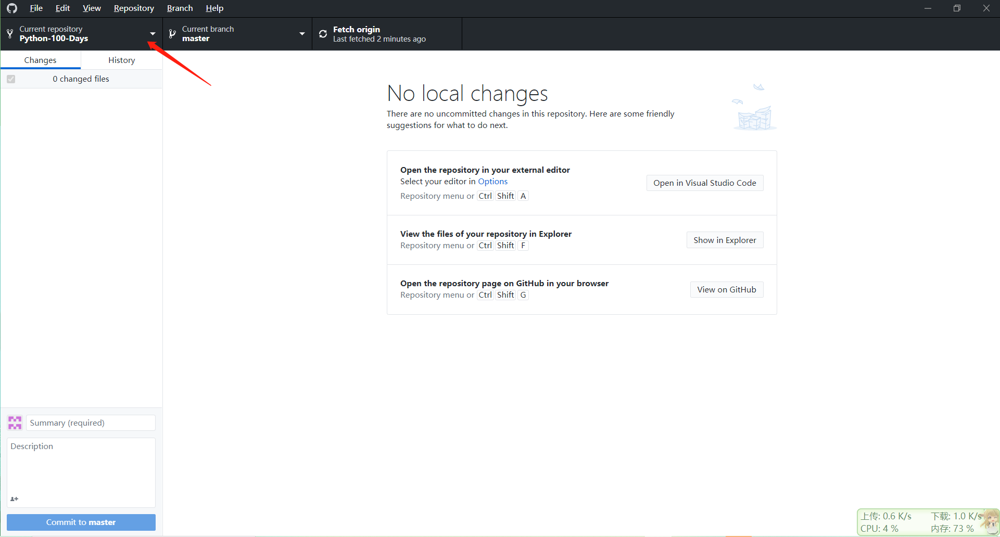

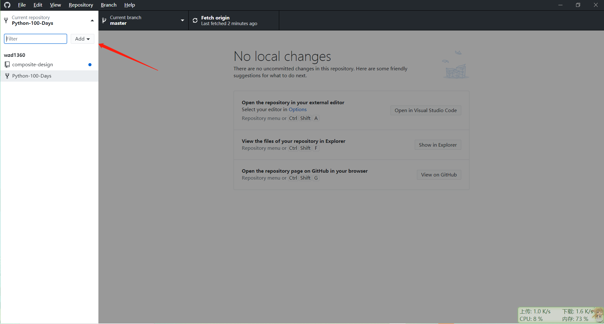

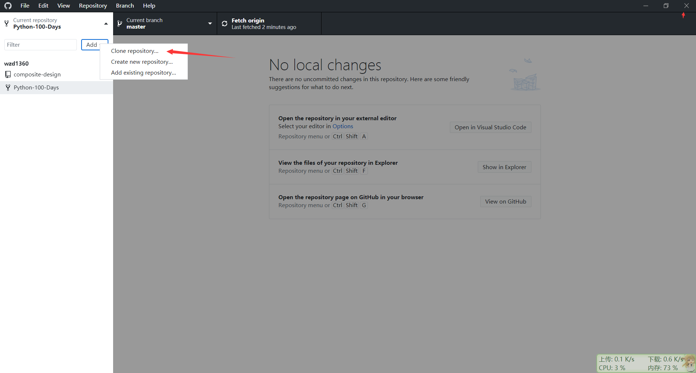

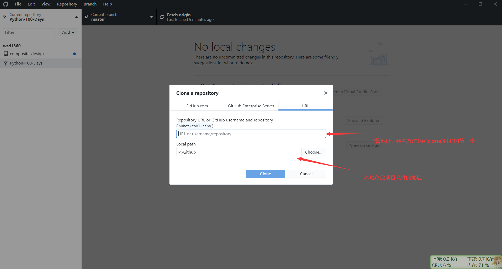

点clone，余下的内容可以自动完成。

## 方法3

啥都不用装。

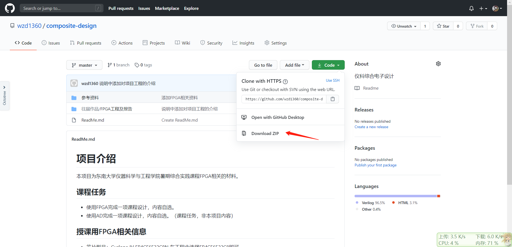

下载压缩包，解压，也是可以的。

就是无法感受到github的魅力。（之后项目有更新不太好管理，需要不断的重新下载）其他两种方法更新的时候只需要把有变化的部分换掉（自动完成），这种方法需要不断手动下载。

