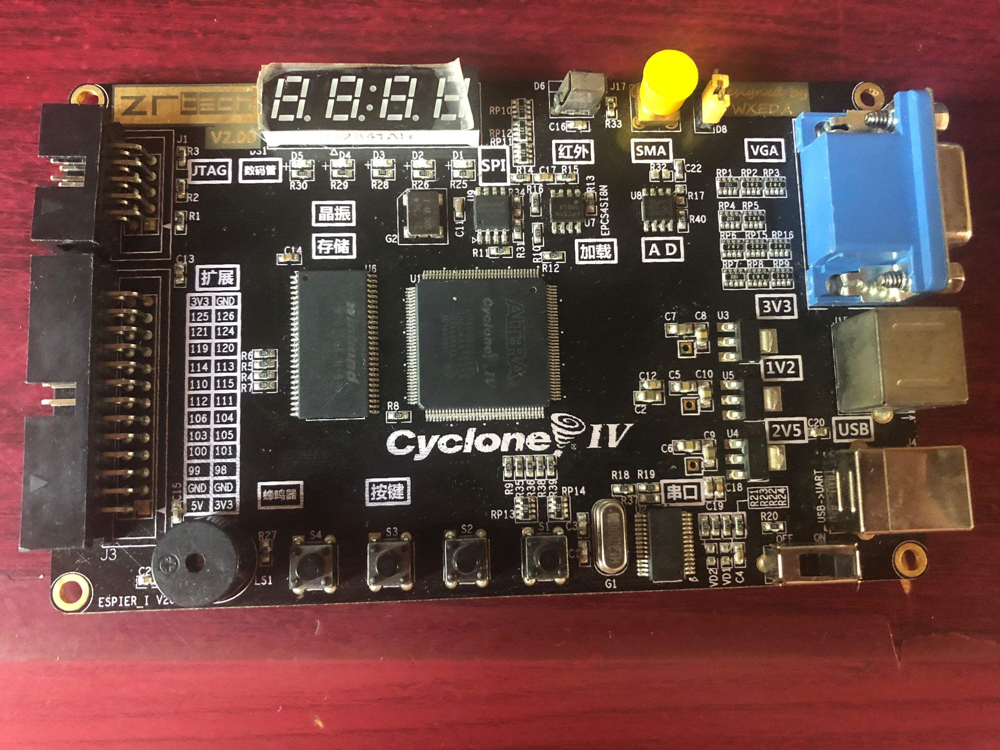
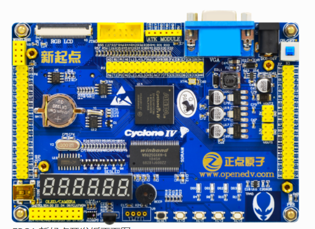

# 项目介绍
本项目为东南大学仪器科学与工程学院暑期综合实践课程FPGA相关的材料。
## 课程任务
- 使用FPGA完成一项课程设计，内容自选。
- 使用AD完成一项课程设计，内容自选。（课程任务，非本项目内容）
## 授课用FPGA相关信息

同学们手中的开发板有两种：

### 比较旧的开发板

旧开发板如下图所示：

芯片信息如下：

| **FPGA芯片型号**  | **Cyclone IV EP4CE6E22C8N，在工程中选择Cyclone E、EP4CE6E22C8即可。** |
| ----------------- | ------------------------------------------------------------ |
| **Flash芯片型号** | **EPCS4，用于程序固化。**                                      |

管脚信息：可以通过原理图查看

（如果有同学自行整理管脚信息表，欢迎联系我）

### 比较新的开发板

新开发板如下图所示：

新板官方资料链接：

[正点原子FPGA新起点开发板](http://www.openedv.com/docs/boards/fpga/zdyz_xinqidian.html)

> 特别感谢17级赖华楷同学对此部分的补充

**注：使用新板的同学，可以直接参考官方的资料，这里只将其中的芯片信息、管脚信息和原理图摘录出来，具体的例程，大家可以自行下载，或者观看官方链接中的在线视频教学。
使用旧板的同学，可以在上述链接的中的视频教程中学习代码撰写和开发，不过配置管脚和芯片的时候，要注意按照旧板的信息配置。**

芯片信息如下：

| FPGA芯片型号      | （还木有查到）     |
| ----------------- | ------------------ |
| **Flash芯片型号** | **（还木有查到）** |

*以上信息还木有查到，因为资料实在是太多了，百度网盘实在是太慢了，哪位机智的小可爱找到了，欢迎联系我，我也想愉快的白嫖。*

管脚信息：摘录自官方文档

| **信号名**                                     | **方向** | **管脚** | **端口说明**                                                 |
| ---------------------------------------------- | -------- | -------- | ------------------------------------------------------------ |
| **系统时钟（50Mhz）**                          |          |          |                                                              |
| sys_clk                                        | input    | E1       | 系统时钟，频率：50Mhz                                        |
| **系统复位（RESET）**                          |          |          |                                                              |
| sys_rst_n                                      | input    | M1       | 系统复位，低电平有效                                         |
| **4个按键**                                    |          |          |                                                              |
| key[0]                                         | input    | E16      | 按键KEY0                                                     |
| key[1]                                         | input    | E15      | 按键KEY1                                                     |
| key[2]                                         | input    | M2       | 按键KEY2                                                     |
| key[3]                                         | input    | M16      | 按键KEY3                                                     |
| **4个LED灯**                                   |          |          |                                                              |
| led[0]                                         | output   | D11      | LED0                                                         |
| led[1]                                         | output   | C11      | LED1                                                         |
| led[2]                                         | output   | E10      | LED2                                                         |
| led[3]                                         | output   | F9       | LED3                                                         |
| **触摸按键**                                   |          |          |                                                              |
| touch_key                                      | input    | F8       | 触摸按键                                                     |
| **蜂鸣器**                                     |          |          |                                                              |
| beep                                           | output   | D12      | 蜂鸣器                                                       |
| **EPCS(M25P16)**                               |          |          |                                                              |
| epcs_flash_data0                               | input    | H2       | EPCS SPI输入数据                                             |
| epcs_flash_dclk                                | output   | H1       | EPCS SPI时钟                                                 |
| epcs_flash_sce                                 | input    | D2       | EPCS SPI片选信号                                             |
| epcs_flash_sdo                                 | output   | C1       | EPCS SPI输出数据                                             |
| **6位数码管**                                  |          |          |                                                              |
| sel[0]                                         | output   | N16      | 第一个数码管位选信号                                         |
| sel[1]                                         | output   | N15      | 第二个数码管位选信号                                         |
| sel[2]                                         | output   | P16      | 第三个数码管位选信号                                         |
| sel[3]                                         | output   | P15      | 第四个数码管位选信号                                         |
| sel[4]                                         | output   | R16      | 第五个数码管位选信号                                         |
| sel[5]                                         | output   | T15      | 第六个数码管位选信号                                         |
| seg_led[0]                                     | output   | M11      | 数码管段选a                                                  |
| seg_led[1]                                     | output   | N12      | 数码管段选b                                                  |
| seg_led[2]                                     | output   | C9       | 数码管段选c                                                  |
| seg_led[3]                                     | output   | N13      | 数码管段选d                                                  |
| seg_led[4]                                     | output   | M10      | 数码管段选e                                                  |
| seg_led[5]                                     | output   | N11      | 数码管段选f                                                  |
| seg_led[6]                                     | output   | P11      | 数码管段选g                                                  |
| seg_led[7]                                     | output   | D9       | 数码管段选h                                                  |
| **USB串口**                                    |          |          |                                                              |
| uart_rxd                                       | input    | N5       | USB串口接收                                                  |
| uart_txd                                       | output   | M7       | USB串口发送                                                  |
| **VGA接口**                                    |          |          |                                                              |
| vga_hs                                         | output   | B11      | VGA行同步                                                    |
| vga_vs                                         | output   | B10      | VGA场同步                                                    |
| vga_rgb[0]                                     | output   | B4       | VGA蓝色                                                      |
| vga_rgb[1]                                     | output   | A4       | VGA蓝色                                                      |
| vga_rgb[2]                                     | output   | B3       | VGA蓝色                                                      |
| vga_rgb[3]                                     | output   | A3       | VGA蓝色                                                      |
| vga_rgb[4]                                     | output   | A2       | VGA蓝色                                                      |
| vga_rgb[5]                                     | output   | B7       | VGA绿色                                                      |
| vga_rgb[6]                                     | output   | A7       | VGA绿色                                                      |
| vga_rgb[7]                                     | output   | B6       | VGA绿色                                                      |
| vga_rgb[8]                                     | output   | A6       | VGA绿色                                                      |
| vga_rgb[9]                                     | output   | B5       | VGA绿色                                                      |
| vga_rgb[10]                                    | output   | A5       | VGA绿色                                                      |
| vga_rgb[11]                                    | output   | A10      | VGA红色                                                      |
| vga_rgb[12]                                    | output   | B9       | VGA红色                                                      |
| vga_rgb[13]                                    | output   | A9       | VGA红色                                                      |
| vga_rgb[14]                                    | output   | B8       | VGA红色                                                      |
| vga_rgb[15]                                    | output   | A8       | VGA红色                                                      |
| **RGB TFT-LCD接口**                            |          |          |                                                              |
| lcd_de                                         | output   | T2       | RGB LCD数据使能                                              |
| lcd_hs                                         | output   | T3       | RGB LCD行同步                                                |
| lcd_vs                                         | output   | P3       | RGB LCD场同步                                                |
| lcd_pclk                                       | output   | R3       | RGB LCD像素时钟                                              |
| lcd_bl                                         | output   | R1       | RGB LCD背光控制                                              |
| lcd_rst                                        | output   | L1       | RGB LCD系统复位，低有效                                      |
| lcd_rgb[0]                                     | output   | T6       | RGB LCD蓝色                                                  |
| lcd_rgb[1]                                     | output   | R5       | RGB LCD蓝色                                                  |
| lcd_rgb[2]                                     | output   | T5       | RGB LCD蓝色                                                  |
| lcd_rgb[3]                                     | output   | R4       | RGB LCD蓝色                                                  |
| lcd_rgb[4]                                     | output   | T4       | RGB LCD蓝色                                                  |
| lcd_rgb[5]                                     | output   | T9       | RGB LCD绿色                                                  |
| lcd_rgb[6]                                     | output   | R8       | RGB LCD绿色                                                  |
| lcd_rgb[7]                                     | output   | T8       | RGB LCD绿色                                                  |
| lcd_rgb[8]                                     | output   | R7       | RGB LCD绿色                                                  |
| lcd_rgb[9]                                     | output   | T7       | RGB LCD绿色                                                  |
| lcd_rgb[10]                                    | output   | R6       | RGB LCD绿色                                                  |
| lcd_rgb[11]                                    | output   | R11      | RGB LCD红色                                                  |
| lcd_rgb[12]                                    | output   | T11      | RGB LCD红色                                                  |
| lcd_rgb[13]                                    | output   | R10      | RGB LCD红色                                                  |
| lcd_rgb[14]                                    | output   | T10      | RGB LCD红色                                                  |
| lcd_rgb[15]                                    | output   | R9       | RGB LCD红色                                                  |
| **红外遥控**                                   |          |          |                                                              |
| remote_in                                      | input    | M15      | 红外接收信号                                                 |
| **单总线（DS18B20/DHT11）**                    |          |          |                                                              |
| dq                                             | inout    | F10      | 单总线                                                       |
| **IIC总线（EEPROM/环境光传感器/RTC实时时钟）** |          |          |                                                              |
| iic_scl                                        | output   | D8       | IIC时钟信号线                                                |
| iic_sda                                        | inout    | C8       | IIC双向数据线                                                |
| SDRAM                                          |          |          |                                                              |
| sdram_clk                                      | output   | B14      | SDRAM 芯片时钟                                               |
| sdram_cke                                      | output   | F16      | SDRAM 时钟有效                                               |
| sdram_cs_n                                     | output   | K10      | SDRAM 片选                                                   |
| sdram_ras_n                                    | output   | K11      | SDRAM 行有效                                                 |
| sdram_cas_n                                    | output   | J12      | SDRAM 列有效                                                 |
| sdram_we_n                                     | output   | J13      | SDRAM 写有效                                                 |
| sdram_ba[0]                                    | output   | G11      | SDRAM Bank地址                                               |
| sdram_ba[1]                                    | output   | F13      | SDRAM Bank地址                                               |
| sdram_dqm[0]                                   | output   | J14      | SDRAM 数据掩码                                               |
| sdram_dqm[1]                                   | output   | G15      | SDRAM 数据掩码                                               |
| sdram_addr[0]                                  | output   | F11      | SDRAM 行/列地址                                              |
| sdram_addr[1]                                  | output   | E11      | SDRAM 行/列地址                                              |
| sdram_addr[2]                                  | output   | D14      | SDRAM 行/列地址                                              |
| sdram_addr[3]                                  | output   | C14      | SDRAM 行/列地址                                              |
| sdram_addr[4]                                  | output   | A14      | SDRAM 行/列地址                                              |
| sdram_addr[5]                                  | output   | A15      | SDRAM 行/列地址                                              |
| sdram_addr[6]                                  | output   | B16      | SDRAM 行/列地址                                              |
| sdram_addr[7]                                  | output   | C15      | SDRAM 行/列地址                                              |
| sdram_addr[8]                                  | output   | C16      | SDRAM 行/列地址                                              |
| sdram_addr[9]                                  | output   | D15      | SDRAM 行/列地址                                              |
| sdram_addr[10]                                 | output   | F14      | SDRAM 行/列地址                                              |
| sdram_addr[11]                                 | output   | D16      | SDRAM 行/列地址                                              |
| sdram_addr[12]                                 | output   | F15      | SDRAM 行/列地址                                              |
| sdram_data[0]                                  | inout    | P14      | SDRAM 数据                                                   |
| sdram_data[1]                                  | inout    | M12      | SDRAM 数据                                                   |
| sdram_data[2]                                  | inout    | N14      | SDRAM 数据                                                   |
| sdram_data[3]                                  | inout    | L12      | SDRAM 数据                                                   |
| sdram_data[4]                                  | inout    | L13      | SDRAM 数据                                                   |
| sdram_data[5]                                  | inout    | L14      | SDRAM 数据                                                   |
| sdram_data[6]                                  | inout    | L11      | SDRAM 数据                                                   |
| sdram_data[7]                                  | inout    | K12      | SDRAM 数据                                                   |
| sdram_data[8]                                  | inout    | G16      | SDRAM 数据                                                   |
| sdram_data[9]                                  | inout    | J11      | SDRAM 数据                                                   |
| sdram_data[10]                                 | inout    | J16      | SDRAM 数据                                                   |
| sdram_data[11]                                 | inout    | J15      | SDRAM 数据                                                   |
| sdram_data[12]                                 | inout    | K16      | SDRAM 数据                                                   |
| sdram_data[13]                                 | inout    | K15      | SDRAM 数据                                                   |
| sdram_data[14]                                 | inout    | L16      | SDRAM 数据                                                   |
| sdram_data[15]                                 | inout    | L15      | SDRAM 数据                                                   |
| **摄像头接口（OV5640/OV7725）**                |          |          |                                                              |
| cam_pclk                                       | input    | R13      | cmos 数据像素时钟                                            |
| cam_vsync                                      | input    | P9       | cmos 场同步信号                                              |
| cam_href                                       | input    | M9       | cmos 行同步信号                                              |
| cam_xclk                                       | output   | T13      | cmos 主时钟                                                  |
| cam_rst_n                                      | output   | L9       | cmos 复位信号，低电平有效                                    |
| cam_pwdn     /cam_sgm_ctrl                     | output   | R12      | cmos 电源休眠模式选择信号/cmos  时钟选择信号（0：使用引脚XCLK提供的时钟 1：使用摄像头自带的晶振提供时钟） |
| cam_scl                                        | output   | N9       | cmos IIC时钟信号线                                           |
| cam_sda                                        | inout    | L10      | cmos IIC双向数据线                                           |
| cam_data[0]                                    | input    | K9       | cmos 数据                                                    |
| cam_data[1]                                    | input    | P8       | cmos 数据                                                    |
| cam_data[2]                                    | input    | N8       | cmos 数据                                                    |
| cam_data[3]                                    | input    | M8       | cmos 数据                                                    |
| cam_data[4]                                    | input    | P6       | cmos 数据                                                    |
| cam_data[5]                                    | input    | N6       | cmos 数据                                                    |
| cam_data[6]                                    | input    | R14      | cmos 数据                                                    |
| cam_data[7]                                    | input    | T14      | cmos 数据                                                    |
| **SD卡（SPI模式）**                            |          |          |                                                              |
| sd_miso                                        | input    | K1       | SD卡SPI串行输入数据                                          |
| sd_clk                                         | input    | J2       | SD卡SPI时钟                                                  |
| sd_cs                                          | input    | C2       | SD卡SPI片选                                                  |
| sd_mosi                                        | output   | D1       | SD卡SPI串行输出数据                                          |
| **SD卡（SDIO模式）**                           |          |          |                                                              |
| sdio_sck                                       | output   | J2       | SD卡SDIO时钟                                                 |
| sdio_cmd                                       | inout    | D1       | SD卡SDIO命令                                                 |
| sdio_d0                                        | inout    | K1       | SD卡SDIO数据                                                 |
| sdio_d1                                        | inout    | K2       | SD卡SDIO数据                                                 |
| sdio_d2                                        | inout    | B1       | SD卡SDIO数据                                                 |
| sdio_d3                                        | inout    | C2       | SD卡SDIO数据                                                 |
| **无线（NRF24L01）**                           |          |          |                                                              |
| nrf_ce                                         | output   | J1       | RX或TX模式选择                                               |
| nrf_cs                                         | output   | G2       | NRF SPI片选                                                  |
| nrf_sck                                        | output   | F2       | NRF SPI时钟                                                  |
| nrf_mosi                                       | output   | F1       | NRF SPI串行输出数据信号                                      |
| nrf_miso                                       | input    | F3       | NRF SPI串行输入数据信号                                      |
| nrf_irq                                        | input    | G1       | NRF 中断信号                                                 |
| **ATK MODULE**                                 |          |          |                                                              |
| uart_rx                                        | input    | C3       | 接收端口                                                     |
| uart_tx                                        | output   | D4       | 发送端口                                                     |
| gbc_key                                        | input    | A13      | 按键端口                                                     |
| gbc_led                                        | output   | B13      | led端口                                                      |

## 文件目录说明

| 文件夹/文件名     | 说明                                                         |
| ----------------- | ------------------------------------------------------------ |
| 参考资料          | 包含例程、芯片信息、管脚信息和外设信息等                     |
| 第一节课内容      | 临时文件，可忽略                                             |
| 往届作品          | 往届学生提交的工程代码和实验报告，可以作为各位同学最终提交内容的参考 |
| Github使用方法.md | 考虑到同学们可能没有使用过github，将Github的使用方法整理放在项目中，大家可以参考使用，节省各位同学搜集资料的时间。 |
| .assets后缀的文件 | 这些文件对于各位同学来说没有什么特别的作用，可以不看。这些文件存放的是相同名称的.md文件中的图片,是由于.md文件的特性所生成的文件。具体为什么，大家感兴趣可以研究一下markdown文本编辑器（有很多，比如typora）的使用方法。 |

## Q&A
1. 如何通过文件配置管脚信息？
用文件配置管脚信息在需要分配的管脚比较多的时候会比在pin planner里面一个个配置方便很多。具体操作可以参考下方教程。
[在Quartus II中分配管脚的两种常用方法](https://www.cnblogs.com/yuphone/archive/2010/01/18/1650612.html)

