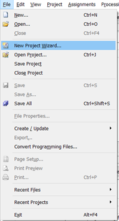
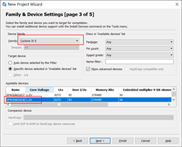
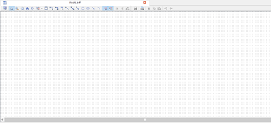
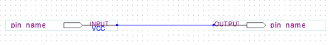
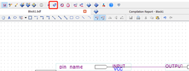
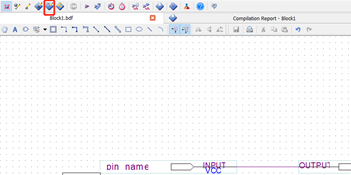
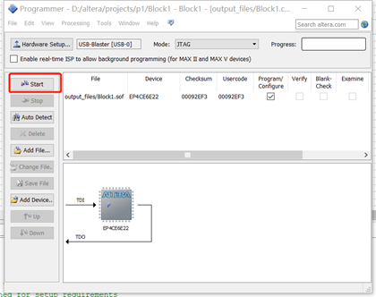
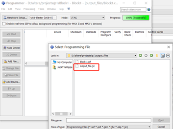
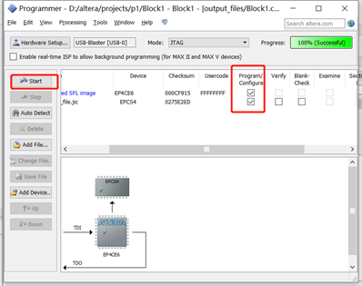

# quartus使用指南——如何从零完成一个工程

## 1. 实验前的准备

### 1. 安装驱动

1. 插上板卡，一个是电源线，一个是数据线；

2. 打开“我的电脑”，右键，属性，设备管理器，其他设备，更新驱动，从指定文件夹中选择，找到quartus的安装路径（注意是安装路径，不是安装包路径），在安装目录下面找到quartuII 13/quartus/drivers，选中后确定，即可完成驱动安装工作，安装好的提示如下：

## 2. 正式实验

完成一个项目可以分成四步：创建工程、编写代码与分析、综合、烧录。接下来会对每一步的操作进行逐步的讲解。

### 2.1 新建工程

- 在File目录下找到New Project选项，打开

​     

- 得到下面这样的弹窗，第一行为工程存放的目录，注意**不能包含任何中文名称，不然会报错**。第二行为工程名称，起一个英文名字就好，设置好点Next

- 点完New会弹出一个导入已有文件的菜单，可以直接跳过，也就是再点一次Next，会进入下面这个目录。这里要选择FPGA芯片的型号，也就是图中两个对话框中的内容。选择自己使用的板子的型号就好。型号可以直接观察FPGA芯片的铭文，也可以去本Github首页的Readme.md中查找。

- 之后直接next，直到finish

到这里，工程创建完成，要注意的问题有以下两点：

1. 工程所在目录不能有中文
2. 不要选错了芯片的型号。虽然选错了不会影响编程，但在烧录的过程需要修改。如果有的同学在设定管脚的时候发现找不到管脚编号了，或者软件中的编号方法和原理图中怎么不一样，考虑一下是不是选错了板子的型号。

---

### 2.2 编写代码

**写在本节前面**：

1. 本节侧重讲解操作流程，不讲解代码。代码的编写方式，大家可以去图书馆借Verilog相关书籍、去B站找相关的教学视频、以及参考本开源项目提供的例程。
2. 关于语言的选择：之前的实验课诸位同学学习过原理图编程，除了原理图之外，还可以用Verilog和VHDL。这里推荐大家使用Verilog语言，因为Verilog相对来说，参考资料更为丰富一些。

下面开始正文内容，这里为了偷懒选择了原理图文件作为演示。（以后有时间再改[捂脸]）

- 新建文件：按照图示操作

   

**注意：**每一个工程都会有一个顶层文件（top-level），相当于C++中的main函数，作为整个工程的入口。而一个新工程会把第一个代码文件作为工程的顶层文件。大家在编写的时候一定要注意，**顶层文件的名字，要与工程的名字保持一致**，也就是你在创建工程的时候，把工程命名为什么，这里就要把顶层文件命名为什么。不然会出现实体无法找到的问题。

同样的问题也会出现在创建子模块的时候，**子模块的名字（也就是Verilog代码中跟在module关键字后面的内容），要与子模块的文件名相同**。

如果想要把另一个文件设置成顶层文件该怎么办？两步之后会有讲解。

- 双击网格即出现器件选择

 

- 输入input和output

 

- 保存文件，设为顶层文件（讲解出现了），这里处于习惯手动设置一下，一般地会自动把第一个文件设为顶层文件

 

- 分析：分析只对代码逻辑进行分析，不会生成可以烧录的文件

 

若底下没有报错，则进行后续步骤

 

该部分完成。

---

### 2.3 综合——生成可执行文件

- 选择管脚，管脚选择参考“原理图.pdf”

  **注：其实有通过文件快速大量烧录管脚的方法，大家可以在网络上搜一搜“quartus如何通过文件烧录管脚”。但这门课程应该用不到，硬说用得到那就只能是偷懒不想自己配管脚，想直接把别的同学配好的管脚导出成文件再在自己的工程里导入了。**

 

这里选择pin90（key3）作输入，pin2（led3）作输出

- 开始综合：**综合=分析+生成可烧录文件**，在综合前要配好管脚。综合通常耗时较多，在编写代码时期多用分析，少用综合。

 

没有报错说明综合顺利通过，该部分完成。

---

### 2.4 烧录

- 选中programmer

 

- 若驱动成功下载，则这里可以选择

 

- 选择后出现

 

 **注：没有破解的软件是无法通过综合生成可执行文件的。如果找不到可执行文件，可能是软件没有破解成功。**

这里出现的文件是.sof文件，点击start可以把该文件烧录到开发板中（记得连好电源线和烧录线）。但这种烧录方法有一个问题，就是如果把开发板断电后再上电，会发现开发板恢复到了烧录前的状态，即**每次重启后都需要重新烧录**。在实际使用的时候我们肯定希望写好的程序烧录一次就好了，而不是每次上电都要烧录，这就需要接下来的**固化**操作。

*不过在代码的调试时期，用上面这种方法烧录是很好的，因为烧录.sof文件很快，而且烧录后立刻就能表现出来。固化操作比较繁琐，建议程序调试到最终版后，再进行固化操作。*

**接下来是固化操作的讲解**

- file中找到Convert Programming Files

 

- 打开后如下

 

从上到下：四个红框

1. 第一个红框是选择转换成的文件的格式（转换嘛，就是把一个格式的文件变成另一个，.sof文件不能用来固化，我们就换一个能固化的。）选择.jic
2. 第二个红框是选择flash芯片的型号。（固化的原理其实是，把程序烧到flash里面，之后每次上电，FPGA芯片会自动从flash芯片读取已有的内容。所以对于FPGA芯片来说，依然是每次上电都需要重新刷写，但是固化操作后，人肉操作变成了flash芯片来完成。）flash芯片的型号，大家可以从本开源项目首页的README.md中查找。
3. 选择对应的FPGA芯片型号。鼠标点中这一行后，点击右侧的Add Device，然后找到对应的FPGA芯片的型号。
4. 选择要被转化的文件。第一步选择了转化的目标，这一步选择被转化的目标。选中这一行后，点右侧的Add File，然后找到之前综合生成的.sof文件（通常在output_file文件夹下）
5. 以上都完成后点击右下的Generate，即可完成固化文件的生成。

-  回到之前的programmer，删掉之前的文件，点击add file ，选择生成的.jic文件（默认在output_file下）

 

- 勾上program/configure和Verify（下图少打了一个勾，要打三个）

 

- Successful后，重启板卡（关掉开关再打开），即可。**一定要重新上电才可以哦！**

 

## **Tip****：

- 驱动一定要下载成功，否则无法运行

- 板卡有单独的拨动开关，插上usb并打开开关，电源指示灯会亮（蓝色）

- 项目路径一定要全英文

- 固化程序部分，一定要重启，否则不一定有效果

*感谢季书涵同学为撰写本教程做出的贡献*